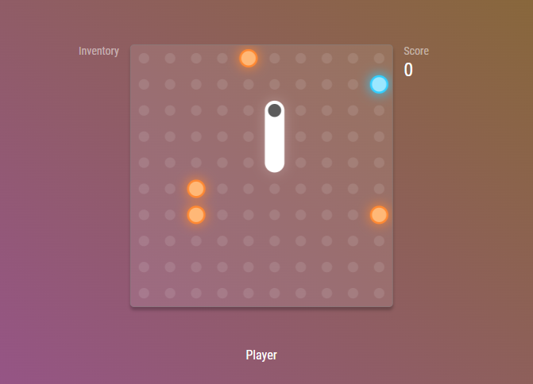

# Sneck
Welcome to Sneck, a modern lookin' remake of the orignal "Snake". It's not exactly the same (there is no snake wormhole yet haha) but you can now play the good old game under modern design.

## Gameplay

### Controls
- ``WASD`` to set move direction
- ``<Hold> WASD`` to move faster
- You can also move by dragging the playfield with mouse (or your finger if you are using touchscreen)

### Scoring system (Singleplayer)
- Orange object: Generic scoring object (``+1`` per object)
- Blue object: Allow you to go over your body (``+2`` per object)
- Green object: Slice your tail by 5 tiles (``+3`` per object)

### Combat system (Multiplayer)
- Each player have a incoming attack queue. After few moves, their tail will get longer, unless they negate all the incoming damage by dealing counter-attack.
- Orange object: Attack single
- Blue object: Go over, no attacks will be rewarded
- Green object: Cut off your tail, and send 3 damages to opponent

> Multiplayer is a planned feature, but there is no ETA for this. Maybe I should look into splitting this repository into multiple packages...
